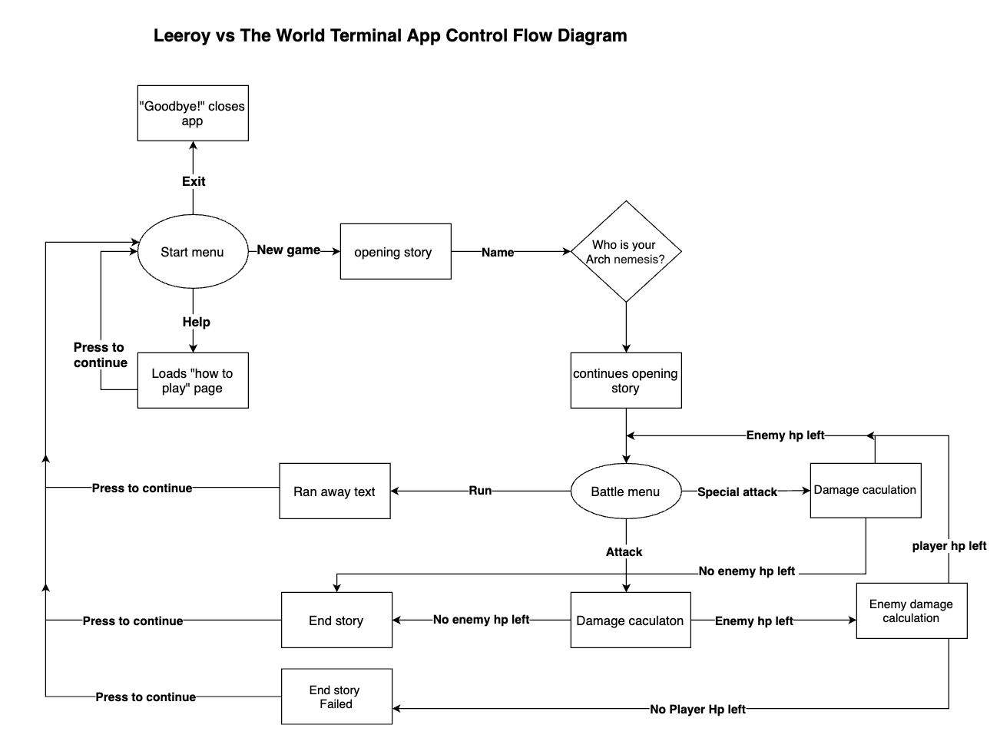
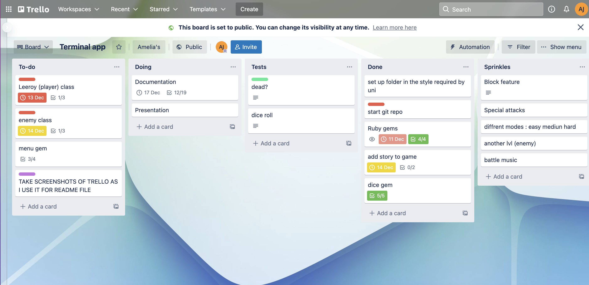
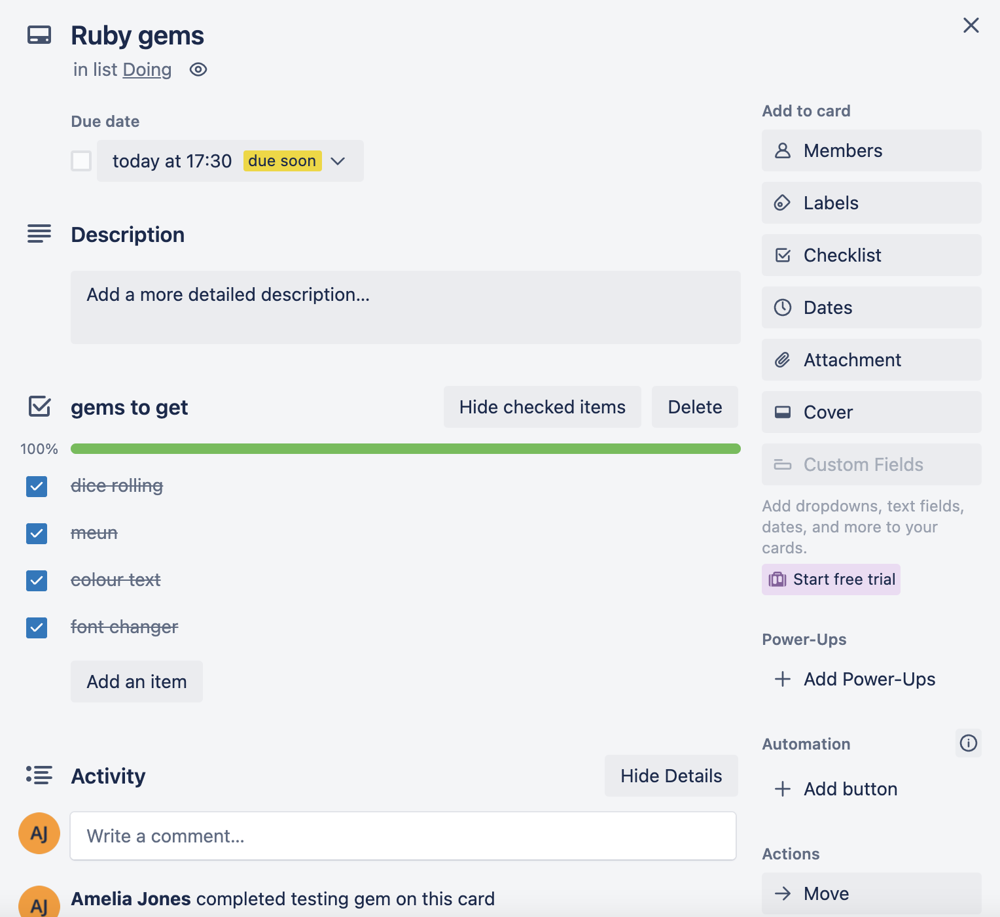
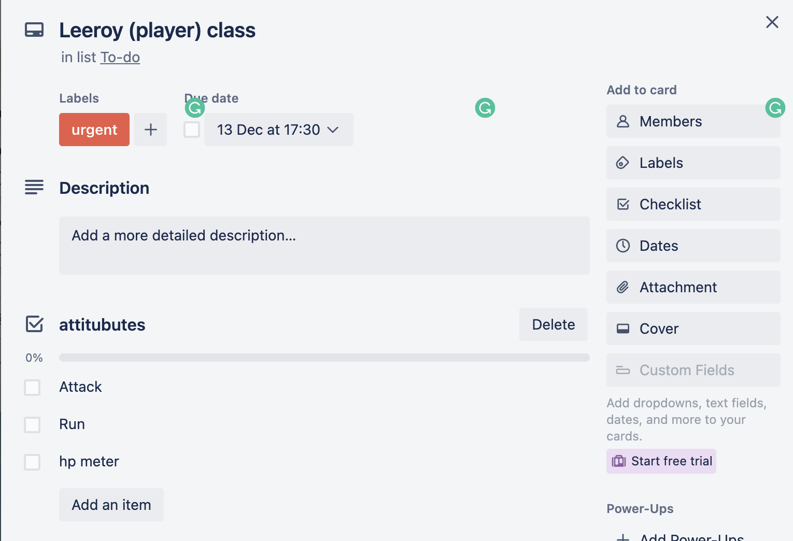
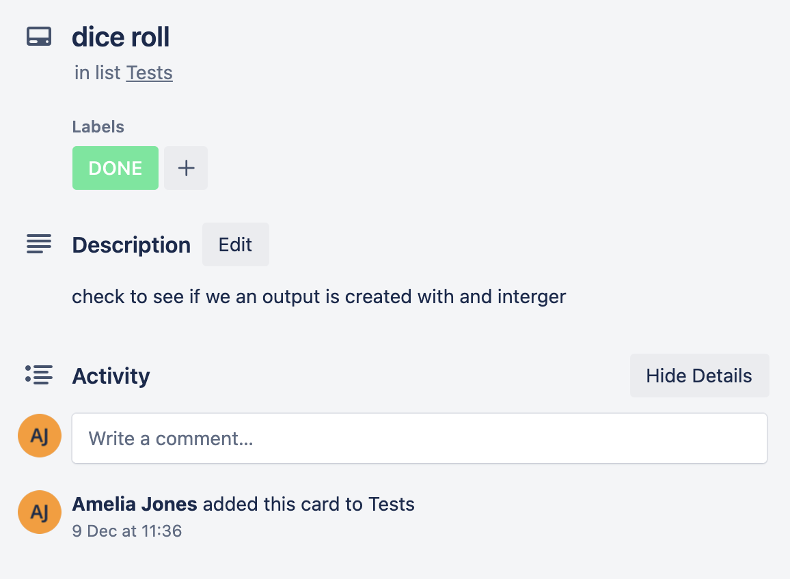

# Leeroy vs The World 

Terminal app assesment for Coder Academy

## Repositoy Link
My [Github Repo](https://github.com/ameliaxjones/Leeroy_vs_The_World)
## Software development plan

This is a quick turn-based fighting game that emulates the combat elements of Tabletop Roleplaying Games 
with the fight menu similar to that of the game Pokemon. 
The user will have options when they first come into contact 
with the enemy, fight, stun or run. Depending on what the 
user picks it will either start the game (fight or stun) 
or end the game (run).  The game rules and logic are loosely 
based on Dungeons and Dragons, the game uses a ruby gem 
that emulates dice rolls for both the player and enemy 
for every attack.  

The app is designed to create a fun and entertaining
 experience for the user. The dice rolling aspect 
 allows the player to be more involved in the game 
 with them not knowing who is going to win with the
random number generator. 

The target audience is people who enjoy tabletop games, 
video games, pokemon, and flight simulators who want a 
quick easy to use the game to cure their boredom.

## Features

### Main

- Dice Role: I have installed a ruby gem to handle the dice rolling. When the player and enemy attack, a dice will automatically be rolled in which the number it lands on is the amount of damage delt. 
 
- Stats: The player can see what Hp they are on as well as the enemy.
 
- Battle Menu: This is a menu created with TTY gem which will help the player choose options they would like to do (Attack, Run).
 
- Main Menu: This is the first menu the user will see and again has been made with TTY.
 
- Story flow: The story was written and implemented into the code to create  background and a sense of purpose as to why you are fighting. 

### Sprinkles (what i would like to add)

Below are features I would like to implement if I have the 
time.

- Block feature : Block action where dice is rolled to see if it is a miss or succeed. If miss goes back to the battle
menu if succeed you block an incoming attack.

- Special Attacks: Instead of just having the one attack having a 'special attack' for a higher change of damage given for both classes. 

- More levels: At the moment there is only one enemy I would like to create more which go up in difficulty. 
 
- Battle music: If I can find a gem to help with this I will add it in.
## Control Flow Diagram

On application launch users will first be introduced to a main
 page where they will be presented with a number of options.
These options are:
- Start Game: Begin the game
- Help: An explanation on how to play the game
- Quit: Manually exit the application

If the user needs more in depth explanation they can go to 
the How to play documentation. However most of features 
will be in the Help section of the menu.

This menu and the battle menu will be done via TTY Promts 
ruby gem. This allows for better user interaction and is 
also great for error handling as this gem has that already 
built into it.  The only data input in this application will
 be when the game starts and asks for the name of the users 
 ‘Archnemesis’, this is where error handling will be used. 

The next menu to appear will the the Battle meun which will 
have the following options: 

- Attack: Will attack the enemy 
- Run: End the game and bring back to the main menu

The Attack option will begin the battle phase of the game, 
this is where the dice gem will be used. A D8 will be rolled 
and the number it gives will be the attack damage. 
As you can see from the below flow chart when either 
the player or enemy HP bar goes down to 0 it will end the game, 
give the end story and go back to the main menu.



## Implementation plan 


To keep track of what I needed to do and give myself 
deadlines I used Trello. You can view my [Trello Board here](https://trello.com/b/cnMfHVYx/terminal-app).
 I will also provide screenshots of my Trello board 
in use below.  

I created four main lists : “To-Do”, “Doing”, “Tests” and 
“Finished” and I would move cards as I went along.  
The only cards i didst move were the testing ones and 
would instead colour mark them as done. This was so I was able to see that I had done the 
tests and not lost the tickets in the 'Finished' list

As you can see from my Trello board the main and most 
urgent tasks I had to complete  were the  two classes 
“Player” and “Enemy”, with this i gave myself a checklist 
of things i needed to accomplish and gave myself a time frame 
to do this within. I also did this with gems too as finding a dice gem was important as
thats what i use to calculate the damage given and delt.





## Tests

Rspec gem was used to create testing for the following
methods:

- Dice roll function works 
- Player attack (damange delt to enemy)
- Enemy has hp 

You can find these tests in 
```
src/player_spec
```

## How To Play

First choose what menu option you would like to use 
- New Game: will start the game 
- Help: will bring you to the Help page
- Exit: will close the app

When you start a new game the first thing that you will do is read the prompt from there all you need to do is type the name of your ‘Archnemisis’. Once that is done another promt will appear with the battle menu. 

- Attack: will attack the enemy
- Run: will bring you back to the main menu

Each round consists of an Attack from each side (player vs enemy) until one looses all HP.  When all Hp is lost it will either show the prompt for winning (defeating the enemy) or the promptly for loosing (the enemy winning) which brings you back to the main menu. 

The user will mainly interact with the app via two menus the Main Menu and Battle menu. There will be a promt for user to input there own answer too. With the use to TTY Prompt for the menus there shouldn't be a need for error handling as that is build into the gem.  The error handling will be for the name input, I will let the user retry three times before a prompt will appear with its own name for the ‘Archnemisis’


## How To Install


### Prerequisites 
- Ruby 
- Bash
- Mac OS (sorry windows)
- Make sure you are running the app from the src folder

### Install steps

```
cd src/
./run.sh install 
```


### Run

```
cd src/
./run.sh 
```

### Help

```
cd src/
./run.sh help 
```


## FAQ

#### How do I install the game?

Follow the above installation steps 
```
cd src/
./run.sh install
```
This will install the game with the gems included

```
cd src/
./run.sh
```
Will start the game

### Why does a random name appear when im naming my archnemesis

Make sure you are only using letter, leaving the 
name as blank or a number will be invalid and produce
a random name.

### How do I exit the game whilst still in battle menu?

If you choose the 'Run' option it will bring you back
to the main menu. 

### How can I find instructions for the game?

In the main menu there is an option for help which 
will tell you how to play. There is also a section above
that tells you how to play too.

